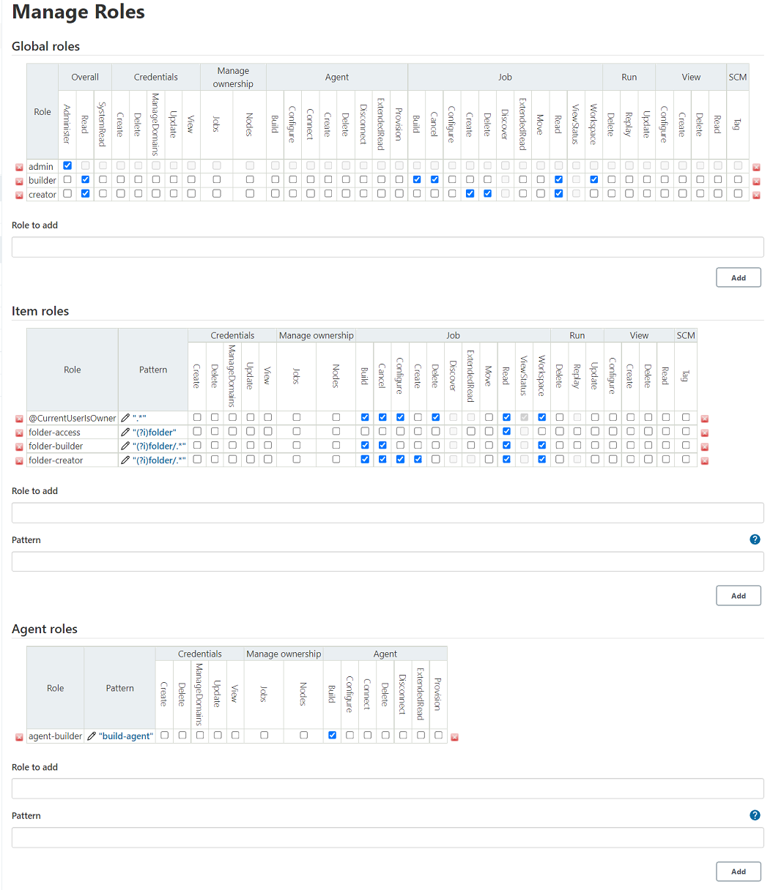
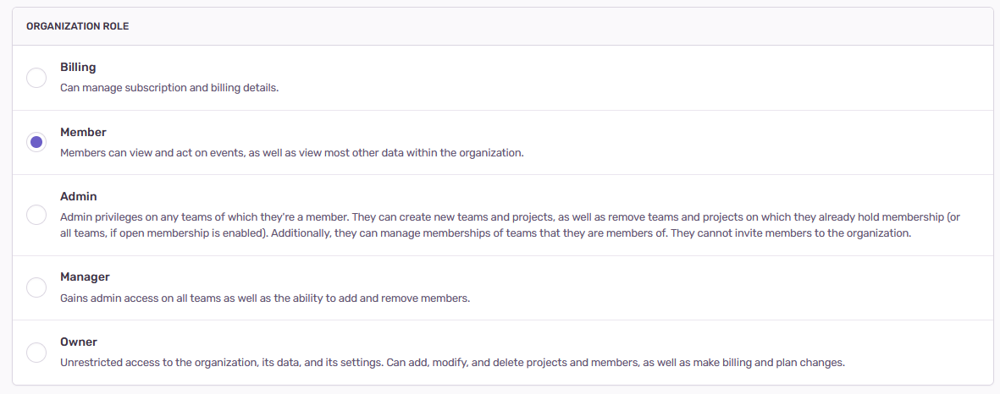
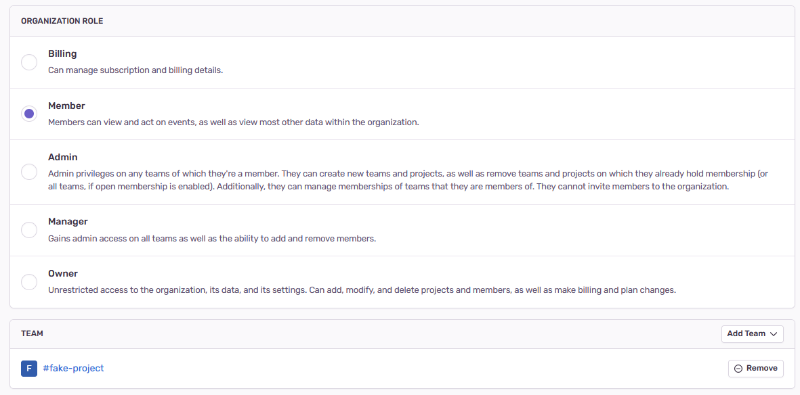

I feel like when it comes to permissions and security, we often fall into the
believe that the more fine-grain control we have, the better.

In reality, this just leave them [ripe to abuse] as more often than not, we'll
simply leave them to the (often bad) defaults as changing them is hard:

[ripe to abuse]: https://www.documentcloud.org/documents/20399900-fbi_flash_sonarqube_access_bc

A simple glance is enough to invoke [analysis paralysis] as you stand there trying to understand what the fuck do any of these mean.

[analysis paralysis]: https://en.wikipedia.org/wiki/Analysis_paralysis

It's the same reason why I have a distinct distaste for software like
[Sonarqube], [Jenkins], [Capciscum], [SELinux]. Controlling over them feels like
wielding a [buster sword], with its sheer weight and unbalanced nature.

[Sonarqube]: https://www.sonarsource.com/products/sonarqube/
[Jenkins]: https://www.jenkins.io/
[Capciscum]: https://wiki.freebsd.org/Capsicum
[SELinux]: https://selinuxproject.org/page/Main_Page
[buster sword]: https://finalfantasy.fandom.com/wiki/Buster_Sword

Compare Jenkins' Role Controls to Sentry's:

Clear distinct roles each with a clear description.

But how about clients or contractors? We don't want them to be able to see
everything.

Sentry's solution is simple, they have the concept of teams:

Projects belongs to teams, members are part of teams, each members' role is set
at the organization level.

When you think about it, this pretty much covers most use cases.

A solution which gives users total freedom to do whatever they want is an easy
way to express a middle finger towards usability and user/developer experience.

Sure, it's cheap to establish and execute at the beginning during the initial
development of the project, but just imagine the sheer amount of human lives
wasted at maintaining this ugly beast of complexity once it is implemented?

- As a user, you're faced with an unwieldy system that feels like you need to
  have a degree for.
- As a developer, you're faced with covering all possible use cases and being
  faced with ridiculous edge cases.
- As customer support, you're faced with numerous calls which lasts for hours
  covering the intricacies of the system and guiding them to avoid pitfalls.
- As a technical writer, trying to come up with a digestible document for an
  inhumane system.

Overall, I feel like both as developers and project managers, it is our sacred
duty to root out all complexity as much as possible.

People don't throw money for complexity, they throw money at tools which helps
them achieve their goals with the least amount of misery.

> But our competition has a lot of fine-grained complexity and sheer amount of features!

Look at [Canva] and [Figma] and ask why users prefer them over [Photoshop],
[InDesign], and [Illustrator].

[Canva]: https://www.canva.com/
[Figma]: https://www.figma.com/
[Photoshop]: https://www.adobe.com/products/photoshop.html
[InDesign]: https://www.adobe.com/products/indesign.html
[Illustrator]: https://www.adobe.com/products/illustrator.html

The reason is simple, they're more approachable while still allowing them to
achieve their goals without [footgunning] themselves.

[footgunning]: https://en.wiktionary.org/wiki/footgun

You don't gain market adoption by being equal. You do it by making your shit
stand out and making a constrained product which allow people to achieve goals
is one of the best way to do it.
