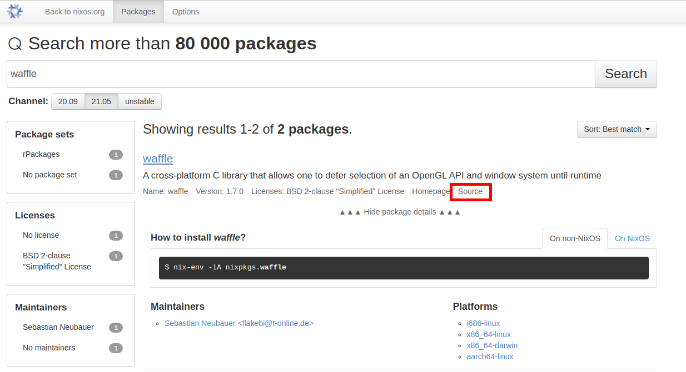

> This article assumes you have installed [Nix](https:https://nixos.org/) on your machine.
>
> You can install it by running:
>
> `$ curl -L https://nixos.org/nix/install | sh`
>
> It works on both Linux and macOS and it won't break your system, I
> promise!

The beginning of your journey as a programmer is always difficult.

Before you even start programming, you have to install a bunch of
tools.

When you are not familiar with the programming language, this issue
becomes exponentionally harder as you are not familiar with the
potential pitfalls.

The fact that not everyone is running the same operating system is
also hard.

Your coworkers runs macOS and they can't help you because you're
running Ubuntu.

That person you met on Discord runs Arch Linux and tells you to simply
move to Manjaro.

But you don't want to change your operating system or buy a new
machine, you already have everything you need personally and
everything is already nicely configured for you.

Why should this be difficult? Couldn't this be easier?

# Instant (development) environments with Nix

Let me demonstrate how Nix can solve this issue:

```nix
{ pkgs ? import <nixpkgs> {}}:

let
  # Python 3.8 environment with all of the packages I require
  pythonEnv = pkgs.python38.withPackages (ps: [
    # Scientific python essentials
    ps.numpy
    ps.scipy
    ps.pandas
    ps.matplotlib

    # Grab samples from the net via Python
    ps.requests
    ps.beautifulsoup4

    # Need this to make the samples more bearable
    ps.nltk

    # Notebook editing
    ps.jupyter
    ps.ipython
  ]);
in
pkgs.mkShell {
  packages = [
    pythonEnv        # The Python 3.8 environment I made.

    # Useful tools to grab samples from the net quickly
    pkgs.wget
    pkgs.curl
    pkgs.httpie      # I'm not good at `curl'. This might help me.

    # Download audio/video samples from the net
    pkgs.youtube-dl
    pkgs.ffmpeg
  ];
}
```

Create an empty folder and save the snippet above as `shell.nix` inside
it.

Once that's done, open a terminal, navigate to the folder, and then
run `nix-shell`.

```shell-session
$ python
Python 3.8.9 (default, Apr  2 2021, 11:20:07)
[GCC 10.3.0] on linux
Type "help", "copyright", "credits" or "license" for more information.
>>> import numpy
Traceback (most recent call last):
  File "<stdin>", line 1, in <module>
ModuleNotFoundError: No module named 'numpy'
>>>
$ jupyter
zsh: command not found: jupyter
$ youtube-dl
zsh: command not found: youtube-dl
$ ls
shell.nix
$ nix-shell
this derivation will be built:
  /nix/store/h3kw8zi4pi6j0p4pnrlfv4qlix0gil0d-python3-3.8.9-env.drv
these 126 paths will be fetched (100.55 MiB download, 512.38 MiB unpacked):
  /nix/store/00cxgc94bssinmw330mkf22kiggmpyhc-python3.8-nbclient-0.5.3
  ...
  /nix/store/zzcilkahrnzk9wh7902zmxgwrsks5bjs-libgcrypt-1.9.3
copying path '/nix/store/wzach25vwapl3sa6f7gylqank3jhhsin-bash-interactive-4.4-p23-dev' from 'https://cache.nixos.org'...
...
copying path '/nix/store/f7j87bxvkvs9i6z91nfnrwnd8ngn9s6q-python3.8-jupyter-1.0.0' from 'https://cache.nixos.org'...
building '/nix/store/h3kw8zi4pi6j0p4pnrlfv4qlix0gil0d-python3-3.8.9-env.drv'...
created 642 symlinks in user environment

[nix-shell:~/trash/python-science]$ python
Python 3.8.9 (default, Apr  2 2021, 11:20:07)
[GCC 10.3.0] on linux
Type "help", "copyright", "credits" or "license" for more information.
>>> import numpy
>>> numpy.array([1,2,3,4,5])
array([1, 2, 3, 4, 5])
>>>

[nix-shell:~/trash/python-science]$ youtube-dl
Usage: youtube-dl [OPTIONS] URL [URL...]

youtube-dl: error: You must provide at least one URL.
Type youtube-dl --help to see a list of all options.

[nix-shell:~/trash/python-science]$ jupyter notebook
[I 11:07:53.286 NotebookApp] Serving notebooks from local directory: /home/yuki/trash/python-science
[I 11:07:53.287 NotebookApp] Jupyter Notebook 6.3.0 is running at:
[I 11:07:53.287 NotebookApp] http://localhost:8888/?token=f9b1...d05e
[I 11:07:53.287 NotebookApp]  or http://127.0.0.1:8888/?token=f9b1...d05e
[I 11:07:53.287 NotebookApp] Use Control-C to stop this server and shut down all kernels (twice to skip confirmation).
[C 11:07:53.371 NotebookApp]

    To access the notebook, open this file in a browser:
        file:///home/yuki/.local/share/jupyter/runtime/nbserver-160202-open.html
    Or copy and paste one of these URLs:
        http://localhost:8888/?token=f9b1...d05e
     or http://127.0.0.1:8888/?token=f9b1...d05e
```

Congratulations, you're now ready to start your data scientist
journey.

Seriously, just like that and you're ready to start doing the things
that data scientists do.

With only Nix, you're able to launch a shell environment with not only
Python and additional libraries but also jupyter, ffmpeg, youtube-dl,
curl, wget, httpie.

It didn't ask you to even run with `sudo` nor nag you about confusing
missing library errors, it just works and all you need is Nix and a
`shell.nix` file.

# What does `shell.nix` do?

Glancing `shell.nix`, you might be able to guess what it is doing.

You're essentially giving Nix a shopping list of what you need in your
shell environment.

You might think the syntax looks weird in comparison to a lot of
similar package managers and I agree.

That's because Nix made their own programming language called the Nix
expression language.

The purpose of this language are mainly to build software and launch
shell environments.

Let's break it down:

```nix
{ pkgs ? import <nixpkgs> {}}:                           # (1)

let
  pythonEnv = pkgs.python38.withPackages (ps: [          # (2)
    # Scientific python essentials
    ps.numpy
    ps.scipy
    ps.pandas
    ps.matplotlib

    # Grab samples from the net via Python
    ps.requests
    ps.beautifulsoup4

    # Need this to make the samples more bearable
    ps.nltk

    # Notebook editing
    ps.jupyter
    ps.ipython
  ]);
in
pkgs.mkShell {                                           # (3)
  packages = [                                           # (4)
    pythonEnv

    pkgs.wget
    pkgs.curl
    pkgs.httpie

    pkgs.youtube-dl
    pkgs.ffmpeg
  ];
}
```

1.  In this line, we're importing the [Nix package collection](https://github.com/NixOS/nixpkgs) (nixpkgs).

    Reading it, you might think this is how you define imports but
    actually, this is how you define lambda functions in Nix.

    Your `shell.nix` file actually define a single function which takes
    `pkgs` as an argument but also provide a default value.

    This is practically similar to the following example in Python:

    ```python
    def shell(pkgs=import_pkgs()):
        ...
    ```

2.  Nix is a functional programming language so variables are defined
    inside a `let` block. These variables will be exposed inside the `in`
    block.

    We define a variable called `pythonEnv` which takes the result of the
    `pkgs.python38.withPackages` function. This function returns an
    altered Python package with the Python libraries we've defined.

    Function calls in Nix doesn't use parentheses similar to Haskell
    and Ruby. You simply pass the arguments to it separated by
    whitespaces.

    The argument we pass is actually another function which takes a
    single argument called `ps` and returns a list of Python
    libraries/packages.

    You might be confused why it needs to be a function and that's
    because this allows multiple Python versions since not all Python
    versions share the same collection of packages.

    You can test this theory yourself: Replace `python38` with
    `python39` and run `nix-shell`.

    ```nix
    { pkgs ? import <nixpkgs> {}}:

    let
      pythonEnv = pkgs.python39.withPackages (ps: [
        # Scientific python essentials
        ps.numpy
        ...
    ```

3.  Now that we have `pythonEnv` nicely defined in the `let` block, we can
    use it inside the `in` block.

    Here we're calling the `pkgs.mkShell` function which allow us to make
    a shell environment with Nix.

    As you can see from the one marked `(2)` and this one, functions
    don't require the `return` keyword and will return the enclosed
    expression.

    This is similar to Haskell and Ruby.

    In this case, our massive `shell.nix` function returns the result of
    `pkgs.mkShell`.

4.  In here, we simply define the packages the shell environment need
    to contain.

    We pass our `pythonEnv` package and lists more packages which are
    non-Python utilities/libraries that are helpful to us.

# Reducing duplicate code using the `with` statement

Reading the `shell.nix`, you might be annoyed by its repetitiveness such
as the repeating `ps` and `pkgs` scattered everywhere.

The Nix expression language provides you with a helpful tool: the `with`
statement.

Here's an example of it in use:

```nix
{ pkgs ? import <nixpkgs> {}}:

let
  pythonEnv = pkgs.python38.withPackages (ps: with ps; [
    # Scientific python essentials
    numpy
    scipy
    pandas
    matplotlib

    # Grab samples from the net via Python
    requests
    beautifulsoup4

    # Need this to make the samples more bearable
    nltk

    # Notebook editing
    jupyter
    ipython
  ]);
in
pkgs.mkShell {
  packages = with pkgs; [
    pythonEnv

    wget
    curl
    httpie

    youtube-dl
    ffmpeg
  ];
}
```

As you can see, using the `with` statement we can omit the `pkgs` and `ps`,
nice.

What it does is simply pepper in the `pkgs.` and `ps.` when it is
required.

If you're still confused, we'll demonstrate it by taking a part of the
previous snippet:

```nix
...
in
pkgs.mkShell {
  packages = with pkgs; [
    pythonEnv

    wget
    curl
    httpie

    youtube-dl
    ffmpeg
  ];
}
```

When Nix sees the `with` statement, it will add the `pkgs` prefix when
required.

This is how Nix will evaluate the `with` statement to:

```nix
...
in
pkgs.mkShell {
  packages = [
    pythonEnv

    pkgs.wget
    pkgs.curl
    pkgs.httpie

    pkgs.youtube-dl
    pkgs.ffmpeg
  ];
}
```

Nix simply checks whether each variable exists. If not, it will add the
`pkgs` prefix. If it exists, it will leave them alone.

In fact, we can go even further and remove all mention of pkgs using a
single `with` statement:

```nix
{ pkgs ? import <nixpkgs> {}}:

with pkgs;

let
  pythonEnv = python38.withPackages (ps: with ps; [
    # Scientific python essentials
    numpy
    scipy
    pandas
    matplotlib

    # Grab samples from the net via Python
    requests
    beautifulsoup4

    # Need this to make the samples more bearable
    nltk

    # Notebook editing
    jupyter
    ipython
  ]);
in
mkShell {
  packages = [
    pythonEnv

    wget
    curl
    httpie

    youtube-dl
    ffmpeg
  ];
}
```

# Learning more about the Nix expression language

It might be difficult for you to wrap your head around the weird
language, especially if you're not familiar with functional
programming.

Don't worry, you will get used to it soon enough.

To follow this and future articles in the series, you don't need to
master the Nix expression language. This series targeted to those who
have 0 knowledge about Nix but have _some_ experience in programming.

However, if you want to learn more about the language itself, check
out [Nix pills](https://nixos.org/guides/nix-pills/basics-of-language.html), [Nix wiki](https://nixos.wiki/wiki/Nix_Expression_Language), and [Nix manual](https://nixos.org/manual/nix/stable/#ch-expression-language).

You can also learn by reading the packages inside the [Nix package
collection](https://github.com/NixOS/nixpkgs).

You can search via [search.nixos.org](https://search.nixos.org/packages) and click on "Source" on the
result:



# Where does `nixpkgs` come from?

```nix
{ pkgs ? import <nixpkgs> {}}:
```

Reading the snippet above, you might wonder where `nixpkgs` is located.

The answer to that is simple: Nix channels.

```shell-session
$ nix-channel --list
nixpkgs https://nixos.org/channels/nixos-21.05
```

Nix channel is similar to the list of repositories that can be found
in other package managers (ex. `/etc/apt/sources.list` in
Debian/Ubuntu).

This is all well and good but there's you will encounter the following
issue: Each Nix user may have different versions `nixpkgs` present.

As of writing, I'm running version 21.05 of `nixpkgs` but you might be
using a newer version of `nixpkgs` or maybe even the `unstable` branch.

This means that your shell environment may break in the future because
nixpkgs will be different or it will break on someone else's machine
because they have a different value for nixpkgs.

# Ensuring reproducibility by pinning with `niv`

Package managers such as npm solves this issue by introducing
dependency pinning.

Essentially, your will have something called a lock file which
accompanies your list of dependencies.

The lock file contains the same list of dependencies but in addition,
it contains the exact version used when you were defining the
dependencies for your project.

This ensures that in the future, you will use the exact same set of
dependencies which introduces reproducibility.

With Nix since most of your packages will originate from `nixpkgs`, you
only need to pin `nixpkgs` itself.

As of writing, Nix does not have this functionality built-in. However,
it is available as an experimental feature called [flakes](https://www.tweag.io/blog/2020-05-25-flakes/).

Because flakes is still experimental, in this article, we will use [Niv](https://github.com/nmattia/niv)
instead which adds dependency pinning to Nix.

You can install niv easily by running the following command:

```shell-session
$ nix-env -iA nixpkgs.niv
```

If you don't want to install and just want to use it temporarily, you
can launch a Nix shell with only niv installed:

```shell-session
$ nix-shell -p niv
```

We will be modifying `shell.nix` and introduce dependency pinning.

Open a terminal with Niv present and navigate to the folder with
the deduplicated version of `shell.nix`.

First, we run `niv init` to start the setup process:

```shell-session
$ ls
shell.nix
$ niv init
Initializing
  Creating nix/sources.nix
  Creating nix/sources.json
  Importing 'niv' ...
  Adding package niv
    Writing new sources file
  Done: Adding package niv
  Importing 'nixpkgs' ...
  Adding package nixpkgs
    Writing new sources file
  Done: Adding package nixpkgs
Done: Initializing
$ ls
nix  shell.nix
$ ls nix
sources.json  sources.nix
```

Niv has started a new Niv project and added both `nixpkgs` and `niv` as
dependencies.

The `nix/sources.nix` file is a small vendored library which reads the
`nix/sources.json`. You will see how it is used later.

The dependencies are listed in `nix/sources.json` and you can use `niv
show` to see what's inside:

```shell-session
$ niv show
nixpkgs
  homepage:
  url: https://github.com/NixOS/nixpkgs/archive/eb73405ecceb1dc505b7cbbd234f8f94165e2696.tar.gz
  owner: NixOS
  branch: release-20.03
  url_template: https://github.com/<owner>/<repo>/archive/<rev>.tar.gz
  repo: nixpkgs
  type: tarball
  sha256: 06k21wbyhhvq2f1xczszh3c2934p0m02by3l2ixvd6nkwrqklax7
  description: Nix Packages collection
  rev: eb73405ecceb1dc505b7cbbd234f8f94165e2696
niv
  homepage: https://github.com/nmattia/niv
  url: https://github.com/nmattia/niv/archive/e0ca65c81a2d7a4d82a189f1e23a48d59ad42070.tar.gz  owner: nmattia
  branch: master
  url_template: https://github.com/<owner>/<repo>/archive/<rev>.tar.gz
  repo: niv
  type: tarball
  sha256: 1pq9nh1d8nn3xvbdny8fafzw87mj7gsmp6pxkdl65w2g18rmcmzx
  description: Easy dependency management for Nix projects
  rev: e0ca65c81a2d7a4d82a189f1e23a48d59ad42070
```

As you can see, it pins both nixpkgs and niv to an exact version, see
the `url` and `rev` which targets a specific commit.

However, if you take a look inside nixpkgs's branch, you see that it
uses the 20.03 version.

That's very outdated. Let's fix that and update it to 21.05.

We can update dependencies with `niv update`:

```shell-session
$ niv update nixpkgs -b release-21.05
Update nixpkgs
Done: Update nixpkgs
$ niv show
nixpkgs
  homepage:
  url: https://github.com/NixOS/nixpkgs/archive/2d6ab6c6b92f7aaf8bc53baba9754b9bfdce56f2.tar.gz
  owner: NixOS
  branch: release-21.05
  url_template: https://github.com/<owner>/<repo>/archive/<rev>.tar.gz
  repo: nixpkgs
  type: tarball
  sha256: 1aafqly1mcqxh0r15mrlsrs4znldhm7cizsmfp3d25lqssay6gjd
  description: Nix Packages collection
  rev: 2d6ab6c6b92f7aaf8bc53baba9754b9bfdce56f2
```

Wonderful.

However, we are not done yet. `shell.nix` didn't import the nixpkgs
defined in `nix/sources.json`. Let's modify it.

This is how we import nixpkgs from `nix/sources.nix`:

```shell-session
let
  # Use nixpkgs from Niv
  sources = import ./nix/sources.nix;                     # (1) We import the sources.nix library.
  pkgs = import sources.nixpkgs {};                       # (2) We import nixpkgs from it.

  pythonEnv = pkgs.python38.withPackages (ps: with ps; [  # (3) This needs pkgs to be added explicitly
    ...
  ]);
in
with pkgs;
mkShell {
  ...
}
```

As you can see the lambda function definition is replaced by defining
`pkgs` as a variable inside the let block.

1.  The `nix/sources.nix` library is imported and assigned as the `sources`
    variable.

    `nix/sources.nix` returns a set of the dependencies as defined inside
    `nix/sources.json`.

2.  We take `nixpkgs` from `sources` and import it.

3.  We also moved `with pkgs;` inside the in block.

    This is because we can't put `with pkgs;` midway in our let block and
    pkgs is only exposed inside the in block.

    Because of this, we readd the `pkgs` prefix for `pythonEnv`. Nothing is
    changed in the `mkShell` thanks to `with pkgs;`.

With all of this in place, we can be certain that our shell
environment is reproducible even in the future with newer versions of
nixpkgs.

Let's take a test drive:

```shell-session
$ cat shell.nix
let
  # Use nixpkgs from Niv
  sources = import ./nix/sources.nix;  # We import the sources.nix library.
  pkgs = import sources.nixpkgs {};    # We import nixpkgs from it.
...
$ nix-shell
this derivation will be built:
  /nix/store/mc3lh57blikblbrj19m17cyh5c5qaprp-python3-3.8.9-env.drv
these 239 paths will be fetched (156.50 MiB download, 857.66 MiB unpacked):
  /nix/store/04b8w8yy6qzvdbrn3rsqkc9splcvs0cj-python3.8-kiwisolver-1.3.1
  ...
  /nix/store/zzv3axnas822sm1h05y0r9djnk73m4kj-libICE-1.0.10
copying path '/nix/store/i7ra1fy8gxcmvpzzxihy25hd3jspzvpw-curl-7.76.1-man' from 'https://cache.nixos.org'...
...
copying path '/nix/store/rcbkp2r2ifnll4b8hxjwd5yzxr9dvvk0-python3.8-jupyter-1.0.0' from 'https://cache.nixos.org'...
building '/nix/store/mc3lh57blikblbrj19m17cyh5c5qaprp-python3-3.8.9-env.drv'...
created 644 symlinks in user environment

[nix-shell:~/trash/python-science]$ python
Python 3.8.9 (default, Apr  2 2021, 11:20:07)
[GCC 10.3.0] on linux
Type "help", "copyright", "credits" or "license" for more information.
>>> import nltk
>>>

[nix-shell:~/trash/python-science]$ jupyter --version
jupyter core     : 4.7.1
jupyter-notebook : 6.3.0
qtconsole        : 5.0.3
ipython          : 7.21.0
ipykernel        : 5.5.0
jupyter client   : 6.1.12
jupyter lab      : not installed
nbconvert        : 6.0.7
ipywidgets       : 7.6.3
nbformat         : 5.1.2
traitlets        : 5.0.5
```

Awesome, it's up and running again!

You can even downgrade to an older version of nixpkgs with `niv update`:

```shell-session
$ niv update nixpkgs -b release-20.09
Update nixpkgs
Done: Update nixpkgs
$ nix-shell
these 2 derivations will be built:
  /nix/store/7zw4ijckcacgij9jqfa9wjinh7qa7b7v-builder.pl.drv
  /nix/store/6lmimxdpdgxr6wsa3y2fpy2n79wvmg81-python3-3.8.8-env.drv
these 344 paths will be fetched (266.92 MiB download, 1345.74 MiB unpacked):
  /nix/store/021jdajrghabnh8p6rvqidgr04rjahrz-gdk-pixbuf-2.40.0
  ...
  /nix/store/zxp8i14r9ngq8hmbbb9h4x4mhmxiyvy2-python3.8-nbformat-5.0.7
copying path '/nix/store/ma08l3jqjhx8b4400x1bb5kvzjb500dp-python3.8-pyOpenSSL-19.1.0' from 'https://hydra.iohk.io'...
...
copying path '/nix/store/rj663ln3skd12irz0z0sx133p065v4a8-python3.8-jupyter-1.0.0' from 'https://cache.nixos.org'...
building '/nix/store/6lmimxdpdgxr6wsa3y2fpy2n79wvmg81-python3-3.8.8-env.drv'...
created 640 symlinks in user environment

[nix-shell:~/trash/python-science]$ python
Python 3.8.9 (default, Apr  2 2021, 11:20:07)
[GCC 10.3.0] on linux
Type "help", "copyright", "credits" or "license" for more information.
>>> import nltk
Traceback (most recent call last):
  File "<stdin>", line 1, in <module>
ModuleNotFoundError: No module named 'nltk'
>>>

[nix-shell:~/trash/python-science]$ jupyter --version
The program 'jupyter' is not in your PATH. It is provided by several packages.
You can make it available in an ephemeral shell by typing one of the following:
  nix-shell -p ihaskell
  nix-shell -p python38Packages.jupyter_core
  nix-shell -p python39Packages.jupyter_core
```

Wait, it failed?

Also, it's Python 3.8.9, not 3.8.8.

Oh, it's because the `packages` argument in `pkgs.mkShell` was introduced
in nixpkgs version 21.05 and isn't present in version 20.09.

Let's fix that by replacing the `packages` argument in pkgs.mkShell to
`buildInputs`.

```nix
let
  ...
in
with pkgs;
mkShell {
  # We change from `packages' to `buildInputs'.
  # Don't ask why it was called that for `pkgs.mkShell'.
  buildInputs = [
    pythonEnv
    ...
  ];
}
```

Let's test it out:

```shell-session
$ nix-shell
these 12 paths will be fetched (1.63 MiB download, 7.00 MiB unpacked):
  /nix/store/3354dzy157x0kijm6pv5khzfx6hf5h8n-nghttp2-1.41.0-dev
  ...
  /nix/store/yi6x0zkhyl6g516c97q1cazpfvv11j4a-curl-7.74.0-dev
copying path '/nix/store/is2d41x8qkx4gd27i8r45q45kv0dynbn-curl-7.74.0-man' from 'https://hydra.iohk.io'...
...
copying path '/nix/store/yi6x0zkhyl6g516c97q1cazpfvv11j4a-curl-7.74.0-dev' from 'https://hydra.iohk.io'...

[nix-shell:~/trash/python-science]$ python
Python 3.8.8 (default, Feb 19 2021, 11:04:50)
[GCC 9.3.0] on linux
Type "help", "copyright", "credits" or "license" for more information.
>>> import nltk
>>>

[nix-shell:~/trash/python-science]$ jupyter
usage: jupyter [-h] [--version] [--config-dir] [--data-dir] [--runtime-dir] [--paths] [--json] [subcommand]
jupyter: error: one of the arguments --version subcommand --config-dir --data-dir --runtime-dir --paths is required

[nix-shell:~/trash/python-science]$ jupyter --version
jupyter core     : 4.6.3
jupyter-notebook : 6.1.4
qtconsole        : 4.7.6
ipython          : 7.17.0
ipykernel        : 5.2.1
jupyter client   : 6.1.7
jupyter lab      : not installed
nbconvert        : 5.6.1
ipywidgets       : 7.5.1
nbformat         : 5.0.7
traitlets        : 4.3.3
```

Cool, it works.

As you can see, it's quite important to pin your dependencies in order
to ensure reproducibility.

You would rather not have things broken at random simply because of
factors that you are not aware of.

Also, people can use the shell environment without having Niv
installed on their machine. They only require to have Nix installed on
their machine.

This is thanks to the vendored library which allows Nix to read the
`nix/sources.json` file.

# Closing

This is the second article in my series about Nix. Hurrah!

As you can see, this series aims for a more practical approach which
can serve as references to people who are new to Nix.

Or to put it in another way, this link of this article will be copy
pasted by me everytime someone ask 'how do I XYZ with Nix?&rdquo; ;)

Let me know what you think so far, my contacts are available in
[yukiisbo.red](https://yukiisbo.red) (Discord is rather inactive, though).

Thanks for reading and I hope you'll be there on the next one!

# Remarks

I should've done this much earlier but I never thought about doing it
until now. Sorry about that.

I would like to thank to those who has reviewed and given me their
input during the writing of this article:

- Ben Siraphob ([@siraben](https://github.com/siraben) at GitHub)
